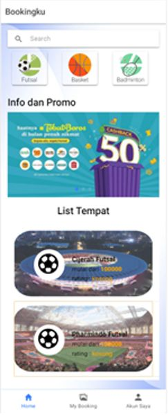

Bookingku Mobile is a mobile application for booking a sport place especially for futsal place. Develop using ionic 3 framework with angular as frontend frameworks  
  
My responsibilities:
- Create authorization and authentication for user
- display all available futsal place
- display filtered futsal place
- Create order method, futsal place owner can see incoming order on Bookingku Website

