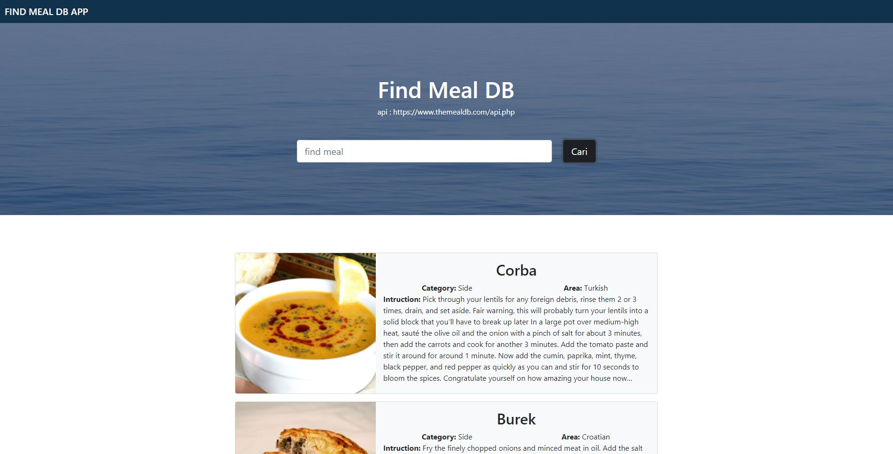

Submission for class "Belajar Fundamental Front-End Web Development"  

What have i learned :
- ECMAScript 6: Learn to apply the latest syntax in JavaScript such as block scope variables, template literals, destructuring objects and arrays, spread operators and rest parameters, arrow functions, classes, promises to JavaScript modules.
- Web Components : Learn to build reusable and encapsulated website UI components with custom elements and shadow DOM.
- Node Package Manager: Learn to add, remove, and use JavaScript packages in NPM, as well as differentiate the functions of development dependencies and production dependencies.
- Webpack : Learn to use webpack as an environment and build tools in building optimal websites.
- Asynchronous JavaScript Request : Learn data transaction via HTTP/HTTPS protocol using fetch API for both GET, POST, PUT, and DELETE methods.

Demo: [Find MealDB](https://find-mealdb-102.netlify.app)

