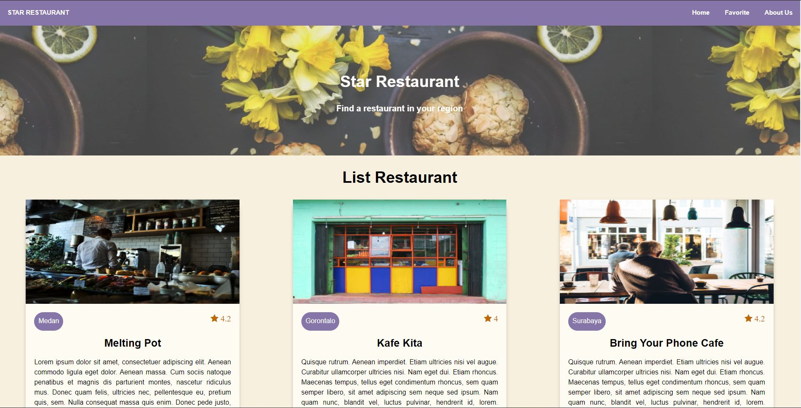

Submission for class "Menjadi Front-End Developer Expert"  

What have i learned : 
- Mobile First Approach: Understand the mobile-first approach, and learn to build responsive websites using the CSS Grid System, Media Query, and Off Screen Canvas through the Mobile First approach.
- Accessibility: Learn aspects of web accessibility such as focus, semantic HTML, tab order, labels, alternative text, and the use of a screen reader so that the website developed can be accessed by anyone.
- JavaScript Clean Code: Learn the principles of writing JavaScript code correctly based on senior software engineer Robert C. Martin which was adopted from his book entitled Clean Code. 
Progressive Web Apps: Learn to make progressive websites so that websites have native properties such as installable, offline capability, and others.
- Automation Testing: Learn to apply testing such as Unit Tests, Integration Tests, and End to End Tests on websites that are created, and learn to use DevTools for debugging.
- Web Performance: Learn to use a web auditor to find out how far the performance of the website created, and optimize website performance based on the results obtained. 

Demo: [Star Restaurant](https://star-restaurant-102.netlify.app)

